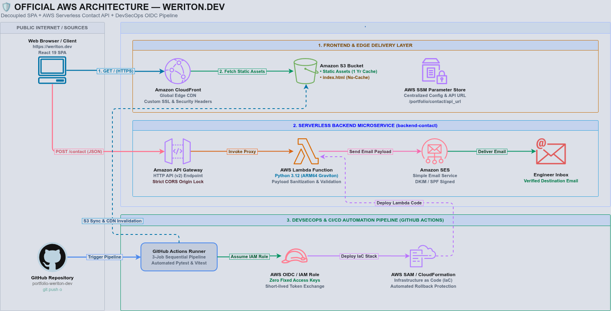
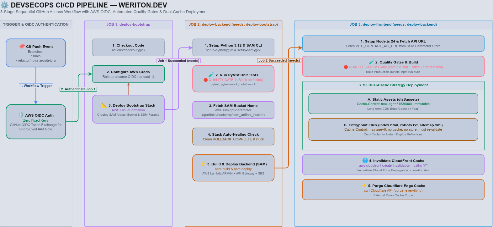

# 🛡️ Forja de Software — Portfolio Fullstack & Cloud Infrastructure

[](https://weriton.dev)
[](https://aws.amazon.com/)
[](https://react.dev/)
[](https://www.typescriptlang.org/)
[](https://docs.github.com/en/actions/deployment/security-hardening-your-deployments/about-security-hardening-with-openid-connect)

> **"Dogfooding de Engenharia de Software:"** Este não é apenas um site estático de apresentação, mas um **produto cloud-native em produção**, projetado e implantado seguindo princípios rígidos de **DevSecOps, Infraestrutura como Código (IaC), Arquitetura Serverless e Alta Disponibilidade na AWS**.

---

## 📌 Visão Geral & Filosofia de Design

O repositório abriga a aplicação **Fullstack & Serverless** do portfólio de **Weriton Petreca** ([weriton.dev](https://weriton.dev)). O projeto foi concebido para resolver o problema comum de "portfólios vitrine" sem profundidade técnica, transformando a própria plataforma de apresentação em um **estudo de caso vivo** de arquitetura de software, resiliência e entrega contínua.

### 🎯 Destaques Arquiteturais
* **Arquitetura Desacoplada (Decoupled SPA + Serverless API):** Frontend React superleve servido globalmente via edge locations (CloudFront + S3), consumindo uma API Serverless isolada para eventos de contato.
* **Segurança Zero-Trust / Zero Fixed Keys:** Autenticação entre GitHub Actions e AWS realizada exclusivamente via **AWS OIDC (OpenID Connect)**. Nenhuma chave de acesso fixa (`AWS_ACCESS_KEY_ID`) vive no repositório.
* **Proteção Anti-Spam & FinOps (Honeypot):** Armadilha *Honeypot* invisível no frontend e backend que detecta bots de spam e executa um *Silent Drop* (`200 OK` sem invocar o Amazon SES), economizando cota e custos.
* **Dual-Persona & Identidade Isolada:** Suporte a duas rotas com identidades visuais e temáticas completamente isoladas através de encapsulamento CSS e SEO dinâmico (`/` para a persona Profissional DevSecOps e `/witcher-realm` para a extensão experimental).
* **SEO Industrial & Open Graph:** Injeção dinâmica de Metadados, Open Graph Cards, Twitter Cards, Favicons dinâmicos alternados por rota e Dados Estruturados em **JSON-LD (Schema.org)** para autoridade no Google.

---

## 🏗️ Arquitetura do Sistema

O **weriton.dev** segue uma arquitetura desacoplada e *serverless-first*, combinando a entrega global de assets estáticos com microsserviços sob demanda na AWS:



---

## 🛠️ Tech Stack & Ferramentas

### **Frontend & UX**
* **Core:** React 19.2, TypeScript 6.0, Vite 8.1.
* **Roteamento & SEO:** React Router v8.1, `react-helmet-async` (Injeção de Metadados e JSON-LD).
* **Estilização & Design System:** Tailwind CSS v4.3, Motion 12.42, Fontes Google.
* **Testes & Qualidade:** Vitest 4.1, Testing Library, Oxlint 1.72 (Linter ultrarrápido em Rust), Prettier.

### **Backend Serverless**
* **Runtime:** Python 3.12 executado em arquitetura **ARM64 (AWS Graviton)** para otimização de custo/performance.
* **Framework IaC:** AWS SAM (Serverless Application Model) / CloudFormation.
* **Serviços AWS:** AWS Lambda (com X-Ray Tracing), Amazon API Gateway, Amazon SES, AWS SSM Parameter Store.
* **Testes Backend:** Pytest, `pytest-mock`, Boto3 mock.

### **DevSecOps & CI/CD**
* **CI/CD Orchestrator:** GitHub Actions executando em Node 24.
* **Autenticação Cloud:** AWS OIDC (OpenID Connect) para assunção de Roles temporárias.
* **Estratégia de Cache Genérica:** Separação estrita S3 entre assets compilados hashed (`dist/assets/*`) e assets públicos de raiz (`dist/*`), forçando revalidação sem hardcode de nomes de arquivos.

---

## 🚀 Pipeline CI/CD (GitHub Actions)

A esteira de entrega contínua é dividida em **3 Jobs encadeados**, garantindo que nenhum código quebre em produção e que os artefatos de infraestrutura sejam versionados com segurança:



### **Estratégia de Cache e Sincronização S3 (Zero Hardcode):**
1. **Assets Compilados Hashed (`dist/assets/*`):** `public, max-age=31536000, immutable` (Cache de 1 ano na CDN para performance máxima).
2. **Assets Públicos e Entrypoints (`dist/*` excluindo `assets/*`):** `public, max-age=0, must-revalidate` com `--metadata-directive REPLACE` (Garante atualização instantânea de HTML, favicons e manifests em novos deploys sem travar na borda).
3. **Invalidação de Borda:** Invalidação automática de cache na distribuição do AWS CloudFront (`/*`).

---

## 📂 Estrutura do Repositório

```text
.
├── .github/
│   └── workflows/
│       ├── deploy.yml                  # Pipeline CI/CD de Deploy (Bootstrap, SAM, Frontend)
│       └── destroy.yml                 # Workflow para teardown completo do ambiente AWS
├── backend-contact/                    # Microsserviço Serverless de Contato (AWS SAM + Python)
│   ├── events/
│   │   └── event.json                  # Evento de teste sintético do API Gateway HTTP API v2
│   ├── src/
│   │   └── app.py                      # Função Lambda em Python 3.12 (Graviton2 ARM64)
│   ├── tests/
│   │   └── test_hander.py              # Suíte de testes unitários do backend (Pytest)
│   ├── env.json                        # Mapeamento de variáveis de ambiente para o SAM Local
│   ├── pytest.ini                      # Configuração do executor do Pytest
│   ├── samconfig.toml                  # Parâmetros padrão de deploy do AWS SAM CLI
│   └── template.yaml                   # Definição de Infraestrutura Serverless (SAM/CloudFormation)
├── docs/
│   └── img/
│       ├── architecture.png            # Diagrama de Arquitetura Serverless (AWS)
│       └── pipeline.png                # Diagrama do Pipeline CI/CD DevSecOps
├── infra/
│   └── bootstrap/
│       └── template.yaml               # Stack CloudFormation de Fundação (Bucket SAM & SSM)
├── public/                             # Assets estáticos globais da raiz
│   ├── apple-touch-icon.png
│   ├── badge-c100-dev.png
│   ├── badge-clf-c02.png
│   ├── badge-dva-c02.png
│   ├── cv-weriton-petreca.pdf          # Currículo em PDF para download
│   ├── favicon-96x96.png
│   ├── favicon.ico                     # Favicon da rota padrão (Monograma W)
│   ├── favicon.svg
│   ├── og-image.jpg                    # Card de prévia Open Graph (1200x630)
│   ├── profile-photo.jpg
│   ├── robots.txt                      # Diretivas de indexação para buscadores
│   ├── site.webmanifest
│   ├── sitemap.xml                     # Mapeamento canônico de URLs para SEO
│   ├── web-app-manifest-192x192.png
│   ├── web-app-manifest-512x512.png
│   └── witcher-favicon.ico             # Favicon dinâmico da rota /witcher-realm
├── src/                                # Código-fonte da aplicação Frontend (React + TypeScript)
│   ├── components/
│   │   ├── layout/                     # Footer, Header e componente de SEO (<Seo/>)
│   │   └── ui/                         # Componentes de interface reutilizáveis (Button, Divider)
│   ├── data/
│   │   └── projects.ts                 # Base de dados estática dos projetos do portfólio
│   ├── lib/
│   │   └── contact.ts                  # Utilitário de consumo da API REST com suporte a Honeypot
│   ├── pages/
│   │   ├── professional/               # Rota / (Persona Profissional DevSecOps)
│   │   │   ├── sections/               # Seções funcionais (Hero, About, Projects, ContactForm, etc.)
│   │   │   └── ProfessionalPage.tsx
│   │   ├── witcher-realm/              # Rota /witcher-realm (Persona Witcher)
│   │   │   └── WitcherRealmPage.tsx
│   │   └── NotFoundPage.tsx            # Tratamento da rota 404
│   ├── styles/
│   │   └── index.css                   # Estilos globais e fontes em Tailwind CSS v4
│   ├── App.tsx                         # Componente raiz da aplicação
│   ├── main.tsx                        # Entrypoint do React 19
│   ├── router.tsx                      # Configuração das rotas do React Router v7
│   └── vite-env.d.ts                   # Definição de tipos de ambiente do Vite
├── tests/                              # Testes de integração do Frontend (Vitest)
│   ├── ContactForm.test.tsx            # Testes do formulário de contato com suporte a Honeypot
│   ├── Footer.test.tsx
│   ├── Projects.test.tsx
│   └── setup.ts                        # Configuração do ambiente de teste com Testing Library
├── index.html                          # Entrypoint HTML do Vite com metadados SEO estáticos
├── package.json                        # Scripts e dependências do projeto frontend
├── package-lock.json
├── README.md                           # Documentação do repositório
├── srs-portfolio-transformacao-v1.0.md # Especificação de Requisitos do Sistema (SRS)
├── tsconfig.json                       # Configuração base do TypeScript
├── tsconfig.app.json
├── tsconfig.node.json
└── vite.config.ts                      # Configuração do Vite e Vitest
```

---

## 🧪 Como Rodar o Projeto Localmente

### **Pré-requisitos**
* Node.js `24.x` ou superior
* Python `3.12.x` (para o backend local)
* AWS SAM CLI & Docker (opcional, para emular Lambda localmente)

### **1. Executando o Frontend**

```bash
# Clone o repositório
git clone [https://github.com/weritonpetreca/portfolio.git](https://github.com/weritonpetreca/portfolio.git)
cd portfolio

# Instale as dependências
npm ci

# Execute o servidor de desenvolvimento
npm run dev
```

Acesse `http://localhost:5173` no seu navegador.

### **2. Executando Testes Unitários e de Integração**

```bash
# Testes do Frontend (Vitest - Libs e Componentes)
npm run test

# Testes do Backend (Pytest - Lambda, Validações e Honeypot)
cd backend-contact
pytest -v
```

---

## 🛡️ Práticas de Segurança Implementadas

* **Princípio do Menor Privilégio (IAM Roles):** As roles temporárias do GitHub Actions e da Lambda possuem permissões estritamente limitadas aos recursos necessários (ex: `ses:SendEmail` restrito à ARN da identidade configurada).
* **CORS Rígido:** A API HTTP Gateway do formulário de contato aceita requisições unicamente originadas do domínio oficial (`https://weriton.dev`).
* **Proteção Honeypot Anti-Spam:** Captura de bots maliciosos no frontend/backend via campo invisível, evitando desperdício de cota do SES.
* **Headers de Segurança HTTP:** Injeção de `X-Content-Type-Options: nosniff` (Anti-MIME Sniffing) e `X-Frame-Options: DENY` (Anti-Clickjacking) nas respostas da API.
* **Observabilidade e Sem Vazamento de PII:** Registro de logs estruturados utilizando o `aws_request_id` (Correlation ID) sem expor dados sensíveis do usuário.
* **Sanitização & Validação de Input:** Proteção contra *Email Header Injection*, limites de payload (Max 10KB) e validações com RegEx antes do processamento.

---

## ✉️ Contato & Redes Profissionais

* **Portfólio em Produção:** [weriton.dev](https://weriton.dev)
* **LinkedIn:** [linkedin.com/in/weriton-petreca](https://linkedin.com/in/weriton-petreca)
* **Credly (Certificações):** [credly.com/users/weriton-luis-petreca](https://www.credly.com/users/weriton-luis-petreca)
* **WhatsApp:** [Enviar mensagem](https://wa.me/5535997231989?text=Ol%C3%A1%20Weriton,%20vi%20seu%20portf%C3%B3lio!)

---

<p align="center">
  <sub>Forjado com orgulho usando React, TypeScript, AWS Serverless e princípios DevSecOps. © 2026 Weriton Petreca.</sub>
</p>