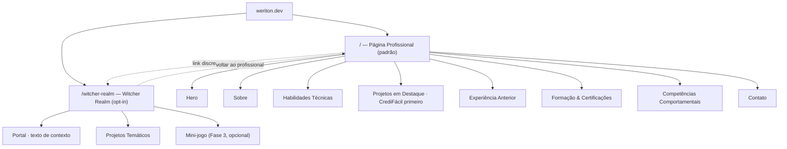

# SRS — Evolução do Portfólio Weriton Petreca
## Migração para React + Vite + TypeScript e Arquitetura de Dupla Persona

| | |
|---|---|
| **Projeto** | portfolio-witcher → Portfólio v2 (Dupla Persona) |
| **Repositório atual** | github.com/weritonpetreca/portfolio-witcher |
| **Autor** | Weriton Luis Petreca |
| **Documento elaborado por** | Claude (Anthropic), a pedido do autor |
| **Versão** | 1.3 |
| **Data** | 05/07/2026 (v1.0) · 06/07/2026 (v1.1 — respostas do checklist · v1.2 — Fase 0 concluída · v1.3 — pivô visual + conteúdo real da Fase 1) |
| **Status** | **Fase 0 concluída** · **Fase 1 em andamento** (conteúdo real implementado, pendente revisão de dados dos projetos secundários) |

---

## 1. Introdução

Este documento especifica a transformação do portfólio de Weriton, hoje um site estático (HTML/CSS/JS puro) inteiramente vestido com a identidade "The Witcher", para uma aplicação **React + Vite + TypeScript** com **duas personas de conteúdo bem definidas**:

1. **Página Profissional** (rota `/`): a experiência padrão de qualquer visitante. Currículo, projetos e trajetória apresentados com a linguagem que o mercado de trabalho espera de um candidato a vaga Back-End Java / AWS.
2. **Witcher Realm** (rota `/witcher-realm`): uma extensão pessoal, opcional e claramente demarcada, onde a paixão pelo universo The Witcher continua viva, através de projetos temáticos e experimentação técnica.

A motivação é dupla. Primeiro, técnica: HTML/CSS/JS puro já cumpriu seu papel, mas não demonstra as competências de front-end moderno que times de engenharia esperam ver mesmo de um candidato Back-End (componentização, tipagem estática, testes automatizados, build tooling). Segundo, estratégica: concentrar a temática Witcher na página principal pode competir, na cabeça de um recrutador que passa poucos segundos avaliando um link, com a mensagem "eu resolvo problemas de arquitetura Java/AWS com maturidade". Separar as personas resolve os dois problemas ao mesmo tempo sem exigir que você abra mão de nada: a Witcher Realm continua existindo, só deixa de ser a porta de entrada.

Este SRS é o contrato de trabalho entre nós para as próximas sessões. Ele documenta **o quê** construir e, em cada decisão relevante, **por quê** — para que você não apenas receba um site novo, mas absorva os conceitos de front-end moderno no processo, do jeito que você pediu.

---

## 2. Análise do Estado Atual

Antes de propor qualquer mudança, clonei o repositório para auditar o que já existe. Eis o raio-x:

**Stack:** HTML5 + CSS3 + JavaScript vanilla, zero build tool. `index.html` (460 linhas) concentra toda a página; `style.css` (629 linhas) e `script.js` (46 linhas) completam o trio. Bibliotecas externas (Font Awesome, Google Fonts, AOS para scroll animations) são carregadas via CDN direto no `<head>`.

**Conteúdo já existente** (que vamos preservar e evoluir, não descartar):
- **Hero**: nome, título, badge "disponível para oportunidades", badge de certificação AWS (linkado ao Credly), CTAs de contato e download de CV.
- **Sobre** ("O Códice do Programador"): a narrativa de transição de carreira (Engenharia Ambiental + gestão rural → Backend). Esse texto é, na minha avaliação, o maior ativo diferencial do seu portfólio — poucos candidatos Júnior/Pleno têm uma história de resiliência tão concreta, e o texto atual já conecta muito bem "ineficiência gera desperdício" na fazenda com otimização de custo em cloud.
- **Arsenal/Skills**: categorias técnicas nomeadas com metáforas Witcher (Poções = Backend, Bestiário = Bancos de Dados, etc.), incluindo uma seção de idiomas e uma de cibersegurança (Hackers do Bem).
- **Projetos**: Vivaldi Bank Core, PetrecaDelivery e Already Read That, cada um com narrativa "Missão/Estratégia" e tags de tecnologia. **O CrediFácil IDP, vencedor do Hack2Hire, ainda não está listado** — é a lacuna mais importante a resolver.
- **Experiência anterior**: gestão da operação leiteira, já bem framed como soft skills (resiliência, gestão de recursos, manutenção preventiva).
- **Formação**: timeline com ADS/UniFatecie, HackTown (2024/2025), Hackers do Bem, AWS re/Start e Engenharia Ambiental. **A vitória no Hack2Hire também não aparece aqui.**
- **Contato**: LinkedIn, WhatsApp, e-mail (com copiar-para-área-de-transferência), GitHub, Credly.

**SEO e Analytics** (ponto forte, vamos manter 100%): meta description, Open Graph completo, Twitter Cards, `canonical`, JSON-LD `schema.org/Person`, `robots.txt`, `sitemap.xml` e Google Analytics (gtag). Isso já é um nível de maturidade em SEO que boa parte dos portfólios júnior não tem — não vamos jogar isso fora, vamos **portar e fortalecer**.

**Infraestrutura** (idem — ponto forte, vamos reaproveitar): Cloudflare (DNS) → AWS CloudFront (CDN + TLS via ACM) → AWS S3 (bucket privado com Origin Access Control) → GitHub Actions fazendo `aws s3 sync` com uma estratégia de cache inteligente (assets com `max-age` de 1 ano, HTML/robots/sitemap sempre revalidados) e invalidação de CloudFront a cada deploy. É uma arquitetura serverless enxuta e correta — o único ajuste necessário é que ela foi desenhada para arquivos estáticos "crus", e agora vamos ter um passo de build no meio.

**Atualização (v1.1)**: confirmado com você — a localidade correta é **Poços de Caldas, MG**. O JSON-LD atual (`Borda da Mata, MG`) está desatualizado e será corrigido já na Fase 1.

**Dívida técnica identificada no pipeline de CI/CD**: o workflow usa `actions/checkout@v4` e `aws-actions/configure-aws-credentials@v4`. Nos seus outros projetos você já padronizou essas actions em `@v6` — vamos alinhar aqui também.

---

## 3. Objetivos da Transformação

| # | Objetivo |
|---|---|
| O1 | Modernizar o stack de front-end para React + Vite + TypeScript, demonstrando competência em ferramentas que o mercado usa hoje. |
| O2 | Separar a apresentação em duas personas de conteúdo: Página Profissional (padrão) e Witcher Realm (opcional, opt-in). |
| O3 | Posicionar o CrediFácil IDP como projeto de destaque, com a vitória no Hack2Hire (Escola da Nuvem + AWS) evidenciada. |
| O4 | Elevar a apresentação de competências comportamentais ao nível que o mercado de tech espera em 2026 (evidência > adjetivo). |
| O5 | Preservar e evoluir o que já funciona: SEO, analytics e a infraestrutura AWS/Cloudflare já provisionada. |
| O6 | Criar uma transição entre personas que pareça uma decisão de design deliberada e madura, não uma inconsistência. |

---

## 4. Escopo

**Dentro do escopo:**
- Reescrita completa do front-end em React + Vite + TypeScript.
- Nova arquitetura de informação com as duas rotas/personas.
- Conteúdo novo/revisado para a Página Profissional, incluindo CrediFácil e Hack2Hire.
- Página Witcher Realm com showcase de projetos temáticos e conceito visual próprio.
- Ideias e proposta de escopo para um mini-jogo (a decisão de construir ou não fica com você — ver seção 11.4).
- Atualização do pipeline de CI/CD para suportar build.

**Fora do escopo (por ora):**
- Backend/CMS para gerenciar conteúdo — o conteúdo será tipado em arquivos TypeScript dentro do próprio projeto (ver seção 9.4, o porquê está lá).
- Blog completo ou sistema de comentários.
- Qualquer redesenho da identidade da Educação Lavanda (projeto separado).
- Migração de domínio ou de provedor de DNS/CDN.

---

## 5. Público-Alvo

Pensar em quem lê cada persona muda o tom de cada uma:

- **Página Profissional**: recrutadores técnicos e não técnicos, hiring managers, tech leads fazendo triagem rápida. Eles escaneiam antes de ler. Precisam entender em segundos: o que você faz, com o que você já resolveu problemas reais, e por que CrediFácil/Hack2Hire importa.
- **Witcher Realm**: um subconjunto curioso desse mesmo público (o recrutador que gostou do que viu e quer entender melhor quem é a pessoa por trás do código), mais colegas devs, comunidade The Witcher/gamedev, e sua própria audiência de LinkedIn/Instagram.

---

## 6. Arquitetura da Informação



**Decisão: rota (`/witcher-realm`), não subdomínio (`witcher.weriton.dev`).**
Um subdomínio reforçaria ainda mais a separação, mas exigiria uma segunda distribuição CloudFront, mais um certificado, mais uma entrada de build no pipeline — complexidade de infraestrutura que não compra benefício suficiente agora. Uma rota dentro do mesmo SPA entrega 90% do efeito de separação (URL diferente, visual diferente, contexto diferente) por uma fração do custo de manutenção. Fica anotado como possível Fase 5 se um dia você quiser ir mais fundo nessa segregação.

---

## 7. Requisitos Funcionais

### 7.1 Estrutura e Navegação
- **RF-01**: O sistema deve ter duas áreas de conteúdo com URLs distintas: `/` (Profissional) e `/witcher-realm` (Witcher Realm).
- **RF-02**: A Página Profissional é a experiência padrão; nenhuma ação é exigida do visitante para acessá-la.
- **RF-03**: Deve existir exatamente um ponto de entrada para a Witcher Realm a partir da página profissional — discreto, no rodapé, sem competir visualmente com o conteúdo de carreira.
- **RF-04**: A navegação entre rotas deve ser client-side (sem reload completo da página).
- **RF-05**: Cada rota deve definir dinamicamente `<title>` e meta tags Open Graph/Twitter próprias.

### 7.2 Página Profissional
- **RF-06**: Seção Hero com nome, título profissional, badge de disponibilidade, badge AWS (linkado ao Credly) e CTAs (contato + download de CV).
- **RF-07**: Seção "Sobre" com a narrativa de transição de carreira, revisada para tom corporativo-acessível — sem nomenclatura Witcher.
- **RF-08**: Seção de Habilidades Técnicas organizada por categoria (Backend, Cloud/DevOps, Testes, Frontend, Banco de Dados, Segurança, Idiomas), com rótulos de categoria em linguagem de mercado.
- **RF-09**: Seção "Projetos em Destaque" com CrediFácil IDP como **primeiro card**, seguido por Vivaldi Bank Core, PetrecaDelivery e Already Read That.
- **RF-10**: O card do CrediFácil deve mencionar explicitamente: vitória no Hack2Hire 2026 (Escola da Nuvem + AWS) — **1º lugar em ambas as etapas de avaliação**, à frente de 11 outras equipes entre 102 participantes —, a equipe (Grupo 12), a arquitetura serverless (Lambda, Step Functions, Amazon Bedrock Data Automation) e a narrativa "cumpriu 100% do Case A escolhido e ainda foi além do escopo pedido" (ver seção 10.1).
- **RF-11**: Seção de Experiência Anterior (gestão rural) preservando o storytelling de soft skills, com tom revisado.
- **RF-12**: Seção de Formação e Certificações (timeline), incluindo o Hack2Hire como marco.
- **RF-13**: Seção dedicada de Competências Comportamentais, com evidências, não apenas adjetivos (ver seção 12).
- **RF-14**: Seção de Contato mantendo os canais atuais (LinkedIn, WhatsApp, GitHub, Credly). O e-mail deixa de ser "copiar endereço" e passa a ser um **formulário de contato embutido na própria página** (nome, assunto, mensagem) — ver seção 9.6 para a decisão técnica de como o envio acontece.
- **RF-15**: Botão de download de CV em PDF, atualizado.

### 7.3 Witcher Realm
- **RF-16**: Página de portal com texto de contexto explicando o propósito da seção antes de qualquer conteúdo temático.
- **RF-17**: Showcase de projetos temáticos existentes (`oo-solid-ninjas`, narrativa Witcher do README do PetrecaDelivery, o próprio site anterior como peça histórica).
- **RF-18** *(Fase 3, opcional)*: Mini-jogo ou experiência interativa original — ver seção 11.4 para as opções.
- **RF-19**: Identidade visual (paleta, tipografia, textura) claramente distinta da Página Profissional.

### 7.4 SEO e Performance
- **RF-20**: Preservar e evoluir `schema.org` JSON-LD, `sitemap.xml`, `robots.txt` e `canonical`.
- **RF-21**: Meta tags Open Graph/Twitter dinâmicas por rota.
- **RF-22**: Manter o Google Analytics (gtag) com tracking de pageview por rota (necessário em SPA, onde a troca de rota não dispara um novo carregamento de página automaticamente).

### 7.5 Infraestrutura e Deploy
- **RF-23**: Pipeline de build (Vite) integrado ao GitHub Actions antes do deploy.
- **RF-24**: Configuração de fallback de SPA no CloudFront (Custom Error Response 403/404 → `/index.html` com status 200).
- **RF-25**: Estratégia de cache-control adaptada ao padrão de saída do Vite (arquivos com hash no nome recebem cache imutável de 1 ano; `index.html` nunca é cacheado).
- **RF-26**: Atualização das GitHub Actions para as versões correntes (`checkout@v6`, `setup-node@v6`, `configure-aws-credentials@v6`).

### 7.6 Qualidade
- **RF-27**: Cobertura de testes automatizados (Vitest + React Testing Library) para os componentes e lógica críticos.
- **RF-28**: Lint (`oxlint`) e formatação (Prettier) automatizados, rodando no pipeline antes do build.

---

## 8. Requisitos Não Funcionais

| # | Requisito |
|---|---|
| RNF-01 | **Performance**: Core Web Vitals na faixa "boa" (LCP < 2,5s, INP < 200ms, CLS < 0,1); Lighthouse Performance ≥ 90. |
| RNF-02 | **Acessibilidade**: WCAG 2.2 nível AA nos elementos críticos (contraste, navegação por teclado, `alt` em imagens, `aria-label` em controles não textuais). |
| RNF-03 | **Responsividade**: mobile-first, testado em pelo menos 3 breakpoints (mobile, tablet, desktop). |
| RNF-04 | **SEO**: nenhuma regressão de indexação em relação ao site atual; sitemap atualizado com as novas rotas. |
| RNF-05 | **Segurança**: zero segredos no bundle client-side; headers de segurança básicos (CSP, X-Content-Type-Options) via CloudFront. |
| RNF-06 | **Manutenibilidade**: TypeScript em modo `strict`; componentes com responsabilidade única; cobertura de testes mínima definida por você e por mim antes da Fase 4. |
| RNF-07 | **Compatibilidade**: últimas 2 versões estáveis de Chrome, Firefox, Safari e Edge. |
| RNF-08 | **Internacionalização**: suporte a um toggle PT-BR/EN via `react-i18next` — **confirmado como requisito** (não é mais opcional), dado que vagas remotas internacionais fazem parte da sua estratégia de carreira. Entra no roadmap na Fase 3 (seção 14). |

---

## 9. Arquitetura Técnica

### 9.1 Stack e o porquê de cada peça

Antes de listar: pesquisei as versões estáveis mais recentes de cada tecnologia agora, em julho de 2026, em vez de confiar no que eu "lembrava" de antes — o ecossistema JS muda rápido e algumas coisas mudaram bastante nos últimos meses (você vai ver um exemplo grande logo abaixo, sobre roteamento).

| Camada | Tecnologia | Versão atual | Por quê |
|---|---|---|---|
| Runtime | Node.js | 24.x (LTS Ativa) | Versão com suporte de longo prazo mais recente; Node 22 já entrou em manutenção. |
| Build tool | Vite | 8.x | Dev server quase instantâneo (ES Modules nativos + esbuild) e build de produção otimizado (Rollup). O Create React App, que você talvez encontre em tutoriais antigos, está descontinuado — Vite é o padrão atual. |
| Linguagem | TypeScript | 6.x | Tipagem estática. Pense nele como o `javac` do mundo JS: erros de tipo (passar uma `string` onde se espera um `number`, esquecer um campo obrigatório) são pegos **enquanto você escreve**, não em produção. Para quem vem de Java, é a transição mais natural possível. |
| Framework UI | React | 19.x | Você já teve contato com ele no CrediFácil; e é o framework mais demandado em vagas full-stack/front-end hoje. |
| Estilização | Tailwind CSS | 4.x | Utility-first: você compõe a aparência com classes (`flex`, `text-lg`, `bg-slate-900`) direto no componente, em vez de manter um `style.css` de 629 linhas que só cresce. Evita a dor mais comum de CSS tradicional, que é o acoplamento entre uma classe e vários lugares do site que dependem dela sem você lembrar. |
| Roteamento | `react-router` | 8.x | **Atenção aqui, porque é uma pegadinha real**: se você pesquisar "React Router" na internet, 90% dos tutoriais vão mandar instalar `react-router-dom`. Esse pacote foi **descontinuado em junho de 2026** com o lançamento da v8 — hoje é só `react-router` (para tudo) e `react-router/dom` (para as poucas APIs específicas de navegador, como `RouterProvider`). Vamos partir direto do jeito certo. |
| Animações | `motion` | 12.x | A biblioteca que você conhecia como "Framer Motion" foi rebatizada para "Motion" — o pacote `framer-motion` ainda existe, mas hoje é só um espelho de compatibilidade. Import correto: `import { motion } from "motion/react"`. |
| SEO por rota | `react-helmet-async` | 3.x | Permite que cada rota declare seu próprio `<title>` e meta tags, resolvendo o RF-05/RF-21. |
| Testes | Vitest + React Testing Library | 4.x / 16.x | Vitest é ao front-end o que o JUnit é ao Java: roda os testes, dá cobertura, tem assertions. React Testing Library testa **comportamento** ("quando eu clico aqui, isso aparece"), não detalhes de implementação — o mesmo princípio de bons testes de unidade que você já pratica com Mockito. |
| Lint / Format | **oxlint** + Prettier 3.x | 1.x / 3.x | **Revisado ao rodar o scaffold (v1.1)**: o próprio `npm create vite@latest` já veio com `oxlint` no lugar de ESLint — e faz sentido manter. Oxlint é um linter em Rust (mesma equipe por trás do Vite/Rolldown), 50-100x mais rápido, hoje maduro o suficiente pra maioria dos projetos novos. Fica pro Prettier só a formatação (upgrade de formatador teria menos maturidade ainda). Equivalente conceitual ao Checkstyle/SpotBugs que você já usa. |
| Deploy | S3 + CloudFront + Cloudflare (reuso) | — | Zero mudança de infraestrutura de ponta a ponta — só ensinamos ela a servir um build em vez de arquivos crus. |
| CI/CD | GitHub Actions | `checkout@v6`, `setup-node@v6`, `configure-aws-credentials@v6` | Alinhado ao seu próprio padrão já validado em outros projetos. |

### 9.2 Estrutura de Pastas

```
portfolio/
├── .github/workflows/deploy.yml
├── public/
│   ├── favicon.ico
│   ├── robots.txt
│   └── sitemap.xml
├── src/
│   ├── main.tsx                    # ponto de entrada
│   ├── App.tsx                     # composição raiz + HelmetProvider
│   ├── router.tsx                  # definição de rotas (react-router)
│   ├── pages/
│   │   ├── professional/
│   │   │   ├── ProfessionalPage.tsx
│   │   │   └── sections/
│   │   │       ├── Hero.tsx
│   │   │       ├── About.tsx
│   │   │       ├── Skills.tsx
│   │   │       ├── Projects.tsx
│   │   │       ├── Experience.tsx
│   │   │       ├── Education.tsx
│   │   │       ├── SoftSkills.tsx
│   │   │       └── Contact.tsx
│   │   └── witcher-realm/
│   │       ├── WitcherRealmPage.tsx
│   │       └── sections/
│   │           ├── Portal.tsx
│   │           ├── ThemedProjects.tsx
│   │           └── Game.tsx        # Fase 3
│   ├── components/
│   │   ├── ui/                     # Button, Card, Badge, SectionTitle...
│   │   └── layout/                 # Header, Footer, Seo.tsx
│   ├── data/                       # conteúdo tipado (ver 9.4)
│   │   ├── projects.ts
│   │   ├── experience.ts
│   │   ├── skills.ts
│   │   └── education.ts
│   ├── hooks/
│   └── styles/
│       └── index.css               # entrypoint Tailwind (@theme)
├── tests/
│   └── setup.ts
├── index.html
├── vite.config.ts
├── tsconfig.json
├── eslint.config.js
└── package.json
```

**Por que essa organização (feature-based, não por tipo de arquivo)?** Uma estrutura ingênua agruparia "todos os componentes" numa pasta e "todas as páginas" em outra. Isso funciona até a quinta seção — depois disso, cada mudança pequena obriga a pular entre pastas distantes. Organizar por feature (`pages/professional/sections/Hero.tsx`) mantém junto o que muda junto — é o mesmo racional de separar módulos por domínio de negócio em vez de por camada técnica, que você já aplica na Arquitetura Hexagonal do Vivaldi Bank Core. `components/ui` guarda só o que é genuinely reutilizável nas duas personas (um `Button`, um `Badge`); tudo o resto vive perto de onde é usado.

### 9.3 Roteamento e Gerenciamento de Estado

Rotas: `/` renderiza `ProfessionalPage`, `/witcher-realm` renderiza `WitcherRealmPage`. Uma rota coringa (`*`) trata 404. Sem rotas aninhadas complexas — não há necessidade.

Estado: **nenhuma biblioteca de state management** (Redux, Zustand, etc.). Um portfólio não tem estado de negócio compartilhado entre telas distantes — o que existe é estado local (um formulário, um menu aberto), perfeitamente resolvido com `useState`/`useContext` nativos do React. Trazer Redux aqui seria como importar uma fila SQS pra dois métodos conversarem dentro do mesmo processo: tecnicamente possível, desnecessariamente pesado. Regra prática: comece sempre pela ferramenta nativa mais simples, adicione complexidade só quando ela doer de verdade.

### 9.4 Conteúdo como dado tipado (sem CMS)

Cada projeto, cada item de experiência, cada habilidade vive como um objeto TypeScript tipado em `src/data/*.ts`, por exemplo:

```typescript
// src/data/projects.ts
export interface Project {
  id: string;
  title: string;
  featured: boolean;
  mission: string;
  strategy: string;
  highlights: string[];
  techTags: string[];
  repoUrl: string;
}

export const projects: Project[] = [
  {
    id: "credifacil-idp",
    title: "CrediFácil IDP",
    featured: true,
    mission: "Eliminar a triagem manual de pacotes de documentos em solicitações de crédito imobiliário.",
    strategy: "Pipeline serverless orientado a eventos na AWS: Step Functions coordena Lambdas, Amazon Bedrock Data Automation extrai os dados e o Amazon Nova estrutura o JSON final.",
    highlights: [
      "🏆 1º lugar no Hack2Hire 2026 (Escola da Nuvem + AWS), nas duas etapas",
      "Score de crédito automatizado — funcionalidade além do escopo do Case A",
      "Verificação humana de campos com baixa confiança, com link direto ao documento",
      "Arquitetura 100% serverless e orientada a eventos, em us-east-1",
    ],
    techTags: ["Python 3.12", "AWS Lambda", "Step Functions", "Amazon Bedrock Data Automation", "Amazon Nova", "EventBridge"],
    repoUrl: "https://github.com/weritonpetreca/credi-facil-idp",
  },
  // ...demais projetos
];
```

**Por que não um CMS (Contentful, Sanity, etc.)?** Um CMS resolve o problema de "pessoas não técnicas editando conteúdo com frequência". Não é o seu caso: você é o único editor, e é desenvolvedor. Um arquivo tipado te dá autocomplete, verificação de tipo em tempo de compilação (esqueceu de preencher `repoUrl`? o TypeScript avisa antes mesmo de rodar) e zero dependência externa ou custo mensal. Se um dia a Educação Lavanda precisar de um CMS (porque a Vanessa vai editar conteúdo direto), aí sim a equação muda — mas não é o caso aqui.

### 9.5 SEO em uma SPA — a ressalva importante

Uma limitação real de qualquer SPA client-side (inclusive a nossa): quando você compartilha `weriton.dev/witcher-realm` no LinkedIn, o crawler do LinkedIn **não executa JavaScript** — ele lê o HTML bruto que o servidor entrega. Se esse HTML for genérico (só a casca vazia do React), o preview do link fica pobre.

Para v1, resolvemos isso parcialmente com `react-helmet-async` (RF-21): ele atualiza as tags no DOM via JS, o que já ajuda o Google (que executa JS ao indexar) mas não ajuda 100% crawlers "preguiçosos" como o do LinkedIn. Fica documentado como **melhoria de Fase 4**: pré-renderizar as rotas estaticamente no build (existem plugins do ecossistema Vite para isso) para que cada rota tenha, desde o primeiro byte, o HTML e as meta tags corretas. Não é bloqueante para o lançamento, mas eu queria que você soubesse exatamente qual é o trade-off que estamos aceitando agora, não descobrir depois por acidente.

### 9.6 Formulário de Contato — como o e-mail sai do site *(adicionado v1.1)*

Você pediu para trocar "copiar e-mail" por um formulário de verdade, preenchido direto na página. Ótima melhoria de UX — mas vale entender uma coisa antes: **um site estático em S3 não tem como enviar e-mail sozinho**. Alguém precisa efetivamente processar os dados do formulário e disparar o envio. Duas rotas, e a boa notícia é que dá para trocar uma pela outra sem reescrever a interface visual:

- **Fase 1 (rápido): EmailJS.** Serviço de terceiros que envia e-mail direto do navegador, sem você manter servidor algum — você conecta sua própria conta de e-mail e o EmailJS dispara o envio usando credenciais que ficam só do lado deles, nunca expostas no seu bundle. Free tier generoso, configuração de minutos. Resolve seu pedido ("direto da página") já no MVP da Fase 1.
- **Fase 3/4 (ambicioso): Lambda + Amazon SES próprios.** Um endpoint seu (API Gateway → Lambda em Java → SES) processando o mesmo formulário. Mais trabalho (SES exige verificação de domínio — que você já tem via Cloudflare — e sair do modo sandbox após aprovação da AWS), mas 100% alinhado com sua trajetória: até o formulário de contato vira prova de arquitetura serverless em Java.

**O porquê de decidir isso agora**: o componente `ContactForm.tsx` vai chamar uma função `sendContactMessage(data)` — só ela sabe, por dentro, se está usando EmailJS ou seu próprio Lambda. É o mesmo princípio de programar contra uma interface em Java em vez de uma implementação concreta (a mesma lógica por trás de preferir injeção via construtor): trocar o "motor" depois não exige tocar no formulário. E de brinde, essa mesma API Gateway + Lambda pode futuramente hospedar também o endpoint de placar do jogo de cartas (seção 11.4) — um único backend serverless pequeno, dois usos.

---

### 9.7 Sistema de Design — "Forjado" *(revisado v1.3, após feedback)*

A primeira direção visual ("prancheta de engenharia") tecnicamente fazia sentido — ligava sua Engenharia Ambiental à Arquitetura de Software — mas não soou como você. Seu feedback foi claro: mais dark/medieval, com a sensibilidade de metal/rock/RPG que já faz parte de quem você é, sem depender da persona Witcher explicitamente. Nova direção, mesma disciplina de execução:

- **Paleta** `forge-950/900` (quase-preto com fundo **quente**, fuligem/carvão — não frio como antes) + `ember` (brasa/ferro em brasa, laranja-avermelhado). Reparou a mudança? A base antiga tinha viés azulado (frio); a nova tem viés de fumaça/fuligem (quente) — é isso que dá a sensação de "forja" em vez de "escritório de engenharia".
- **Tipografia**: **Cinzel** (serifada monumental, inspirada em inscrições romanas — dá peso e gravidade sem cair no cliché de "fonte de RPG" ilegível; é usada em identidade visual de filmes/séries sérias, não é brinquedo) para títulos, IBM Plex Sans no corpo (mantém tudo legível — recrutador ainda precisa escanear rápido), IBM Plex Mono nos rótulos técnicos (mantém o fio condutor "desenvolvedor" mesmo com a estética mais pesada).
- **Assinatura visual**: a "ficha de personagem" no Hero (NOME/CLASSE/STATUS/ORIGEM) no lugar do "title block" de engenharia — mesma ideia estrutural (rótulo carrega informação real), roupagem RPG explícita. Um divisor ornamental geométrico (`Divider.tsx`) marca a transição entre seções, e uma textura de grão bem sutil (`texture-forged`, opacidade 5%) tira a chapadura de um dark-mode liso sem nunca comprometer legibilidade.

**Como isso não colide com a Witcher Realm**: as duas personas continuam distinguíveis, mas agora a diferença é de **registro**, não de "clara x escura". A Página Profissional usa uma paleta fria-de-fumaça (ferro, brasa) e fica dentro dos limites de um portfólio "sério" — pense numa banda de metal séria e seu site oficial de imprensa, não uma fã-page. A Witcher Realm (Fase 2) mantém a paleta verde-musgo/pergaminho já definida e pode ser mais indulgente/imersiva, porque é explicitamente enquadrada como espaço de experimentação pessoal. Ferro e disciplina de um lado; floresta e fogueira do outro.

---

## 10. Conteúdo — Página Profissional

Diretriz geral: cada seção do site atual já tem uma boa espinha dorsal de conteúdo. O trabalho aqui é menos "inventar do zero" e mais **traduzir do vocabulário Witcher para o vocabulário de mercado**, e **inserir o que falta** (CrediFácil, Hack2Hire).

| Seção | O que muda em relação ao site atual |
|---|---|
| Hero | Mantém estrutura; título atualizado se sua meta de vaga mudou desde a última versão. |
| Sobre | Mesma narrativa de transição de carreira (é ótima), reescrita sem termos como "Códice" ou "forjado" — o conteúdo emocional continua, a moldura muda. |
| Habilidades | Mesmas categorias, nomes de mercado ("Backend", "Cloud & DevOps", "Testes", em vez de "Poções", "Alquimia da Nuvem", "Ferramentas do Bruxo"). |
| **Projetos** | CrediFácil IDP entra como primeiro card (RF-09/RF-10). Os outros três sobem uma posição. |
| Experiência Anterior | Narrativa preservada, com o mesmo storytelling de soft skills que já funciona bem hoje. |
| Formação | Timeline atual + marco do Hack2Hire (data do evento, "1º lugar", Escola da Nuvem/AWS). |
| **Competências Comportamentais** | Seção nova — ver seção 12, é onde mais quero seu tempo de leitura. |
| Contato | Mesmos canais de contato; e-mail passa de "copiar endereço" para formulário embutido na página (ver 9.6). |

### 10.1 Estudo de Caso: Como Apresentar o CrediFácil *(finalizado v1.2, com o Case A em mãos)*

Você levantou a pergunta certa: o que pesa mais para um recrutador, ter cumprido 100% do Case A escolhido ou ter adicionado funcionalidades que não foram pedidas? **Resposta curta: os dois, mas em ordem, e por motivos diferentes.**

1. **O resultado primeiro, sem precisar de interpretação.** "1º lugar em ambas as etapas — interna e final com as empresas parceiras — entre 12 equipes" é um fato que qualquer recrutador, técnico ou não, entende sem contexto adicional. Isso vai no topo do card, é o "gancho".
2. **Cumprir 100% do Case A prova execução confiável sob prazo real.** Lendo o documento oficial do case, o pedido era, essencialmente, um tradutor de papel para JSON: receber o pacote de documentos, classificar com BDA, estruturar com Nova, entregar um JSON confiável — ponto. Front-end, mapeamento organizacional e planilha Excel eram bônus *explicitamente* opcionais. Terminar o obrigatório dentro do prazo do hackathon já é sinal forte de disciplina de entrega.
3. **As duas funcionalidades extras é que fazem a diferença entre "competente" e "memorável" — e cada uma por um motivo diferente:**
   - **Score de crédito automatizado**: o case *nomeia* "risco regulatório" como problema de negócio na seção de contexto, mas nunca pede uma funcionalidade de decisão de crédito como entregável — só extração de dados. Vocês perceberam que "extrair dados" e "decidir crédito com segurança" são dois passos de uma mesma jornada, e resolveram o segundo sem que ninguém pedisse. Isso é visão de produto, não só execução técnica.
   - **Verificação humana de campos com baixa confiança**: este é o mais sofisticado do ponto de vista de engenharia. Um sistema de IA generativa erra — é estatisticamente garantido. Um projeto amador ou ignora isso (confia cegamente no output) ou joga a complexidade de volta pro humano (exige revisão manual de tudo, matando o ganho de produtividade). Vocês construíram o meio-termo: o sistema sabe quando desconfiar de si mesmo e direciona *só aquele campo específico*, com link direto ao documento de origem, para revisão humana. É o padrão "human-in-the-loop" que qualquer time sério de ML/IA em produção considera obrigatório.

Isso dá o esqueleto STAR pronto para o card e para uma futura resposta de entrevista:

> **Situação**: Hack2Hire 2026, 102 participantes, 12 grupos, Case A (IDP com Amazon Bedrock) escolhido. **Tarefa**: entregar a solução completa do Case A dentro do prazo do hackathon (15–25/06), usando obrigatoriamente Amazon Bedrock Data Automation e Amazon Nova. **Ação**: equipe entregou 100% dos requisitos obrigatórios do Case A e ainda adicionou duas funcionalidades fora do escopo — score de crédito automatizado e um fluxo de verificação humana para extrações de baixa confiança — antecipando riscos de negócio que o próprio case citava mas não pedia como entregável. **Resultado**: 1º lugar na avaliação interna (nota 4,77) e 1º lugar novamente na etapa final com as empresas parceiras (nota 4,85).

**Enquadramento recomendado para o card** (a redação final é trabalho de Fase 1, mas o ângulo já está fechado): não apresente como "seguimos o case E fizemos mais". Apresente como progressão de maturidade — *entregamos o pipeline obrigatório, identificamos dois riscos de negócio citados no próprio case que a extração sozinha não resolvia, e resolvemos os dois*. Isso responde, sem o recrutador precisar perguntar, à pergunta que todo entrevistador técnico faz sem dizer em voz alta: "essa pessoa só executa specs ou também pensa no problema por trás da spec?"

---

## 11. Conteúdo — Witcher Realm & Ideias de Impacto

Aqui é onde você pediu ideias de verdade, então vamos com calma.

### 11.1 O portal: como sair de um mundo para o outro

A transição entre as duas personas *é* o produto — se ela for abrupta ou mal explicada, parece inconsistência; se for deliberada, parece personalidade. Proposta:

- No rodapé da Página Profissional, um único elemento discreto — um ícone (uma silhueta de lobo original, não o medalhão da CD Projekt Red — mais sobre isso em 11.3) com um microtexto como *"Nas horas vagas, também exploro outros reinos →"*.
- Ao clicar, uma transição visual curta (com `motion`) que muda a paleta de cores em vez de um corte seco — a sensação de "a luz de uma tocha acendendo" é mais interessante do que um simples fade.
- A Witcher Realm abre com um texto de portal que **contextualiza antes de qualquer coisa**, por exemplo:

> *"Bem-vindo à Witcher Realm. Esta é uma extensão pessoal e experimental do meu portfólio, onde uso referências desse universo para explorar conceitos de arquitetura de software e, ocasionalmente, programar por puro prazer. Se você chegou até aqui vindo de uma vaga, ótimo sinal: você também vai ver como eu penso e aprendo fora do horário comercial."*

Esse texto faz um trabalho importante: ele **nomeia** a seção como escolha deliberada de personalidade, não deixa ambíguo. Recrutador nenhum interpreta como falta de maturidade algo que vem com essa moldura.

### 11.2 Ideias de conteúdo para a Witcher Realm

1. **Showcase dos projetos temáticos já existentes** — `oo-solid-ninjas`, a narrativa Witcher do README do PetrecaDelivery, e até este site anterior como "capítulo 1" da sua jornada (comparar antes/depois é um ótimo gancho de conteúdo para o LinkedIn, aliás).
2. **"Bestiário Técnico"**: catalogar conceitos de arquitetura de software como se fossem criaturas — "Monólito", "Race Condition", "N+1 Query" — cada um com descrição, "fraqueza" (como resolver) e "nível de ameaça" (impacto se ignorado). É didático, mostra domínio técnico via metáfora, e é 100% conteúdo original seu (sem tocar em criaturas específicas dos livros/jogos).
3. **Devlog**: pequenos posts explicando como cada peça da Witcher Realm foi construída — reaproveita quase de graça o hábito que você já tem de documentar decisões técnicas.

### 11.3 Um cuidado importante: propriedade intelectual

Vale um parênteses técnico-legal, porque seu portfólio é uma vitrine pública e profissional: o medalhão de lobo, o nome "Gwent", a arte oficial e a tipografia do jogo são propriedade registrada da CD Projekt Red. Usar esses ativos originais (mesmo "só de fã") num site que está, ao mesmo tempo, se vendendo como profissional para recrutadores, é um risco desnecessário — e, com uma leitura irônica, o tipo de detalhe que um bom entrevistador técnico-de-produto poderia até te perguntar sobre.

A boa notícia é que isso não tira nada da experiência: tanto os livros quanto os jogos bebem de um poço muito maior — folclore eslavo, bestiário medieval europeu, alquimia. Recomendo beber da mesma fonte de inspiração (paleta escura, tipografia serifada/gótica, motivos de lobo genéricos, textura de pergaminho) em vez da expressão específica registrada por outra empresa. O resultado visual fica igualmente imersivo, e é 100% seu.

### 11.4 Ideias para o mini-jogo (Fase 3 — sua escolha)

| Opção | Descrição | Esforço | Por que considerar |
|---|---|---|---|
| **A — Jogo de cartas original** ✅ **Escolhida (v1.1)** | Um jogo de cartas de estratégia com regras próprias (não uma cópia de Gwent), com placar salvo num backend serverless próprio — API Gateway + Lambda (Java!) + DynamoDB. | Alto | Conecta a Witcher Realm de volta à sua trajetória Back-End/AWS: Java rodando em produção *dentro* de um projeto divertido. |
| B — Bestiário interativo | Catálogo pesquisável de criaturas originais (inspiradas em folclore, não copiadas), com filtros e fichas técnicas. | Baixo/Médio | Ótimo primeiro projeto React puro: pratica componentização, estado e manipulação de listas sem exigir um backend novo. |
| C — Simulador de alquimia | Puzzle de combinar ingredientes fictícios para gerar efeitos. | Médio | Bom exercício de lógica combinatória no front-end; visualmente divertido. |
| D — Roguelike em canvas | Mini-exploração com combate simples. | Muito alto | Deixaria para um "algum dia" — é o mais caro dos quatro e o que menos conecta com seu objetivo de carreira imediato. |

**Confirmado**: Opção A. Desenvolvimento no seu ritmo — sem pressa, entra formalmente no roadmap só na Fase 3, depois que a Página Profissional e a Witcher Realm estiverem publicadas.

---

## 12. Competências Comportamentais — Diretrizes de Mercado

Isso merece destaque porque é onde a maioria dos portfólios (não só o seu — quase todos) erra: uma lista de adjetivos ("comunicativo", "proativo", "dinâmico") que o recrutador já leu 200 vezes hoje e para de processar. A prática atual de mercado é o oposto: **evidência substitui adjetivo**.

**A técnica**: para cada competência, uma frase no formato Situação/Ação/Resultado, sem precisar nomear a competência — ela fica implícita na história.

| Em vez de dizer... | Mostre... |
|---|---|
| "Sou resiliente" | "Geri uma operação 24/7 onde falha não era opção, por 5 anos, antes de trazer essa mesma exigência de disponibilidade para arquiteturas de software." |
| "Trabalho bem em equipe" | "Parte da equipe vencedora (Grupo 12) do Hack2Hire 2026 com o CrediFácil IDP, um pipeline serverless construído em poucos dias sob pressão de hackathon." |
| "Aprendo rápido" | "Enquanto cursava ADS, conclui a certificação AWS Cloud Practitioner e o programa Hackers do Bem (SENAI/RNP) em paralelo." |
| "Comunico bem ideias técnicas" | "Crio conteúdo técnico-didático no LinkedIn e Instagram, traduzindo conceitos de arquitetura para uma audiência mais ampla." |

**Onde isso mora no site**: não recomendo uma seção isolada tipo lista de bullets soltos — recomendo uma combinação:
1. Uma faixa curta e visualmente destacada com 3-4 evidências-chave (as da tabela acima são ótimas candidatas).
2. O restante tecido diretamente dentro do "Sobre" e da "Experiência Anterior", que é onde a narrativa já flui bem — competência comportamental convence mais como parte de uma história do que como item de checklist ao lado dela.

---

## 13. Plano de Migração

1. **Auditoria de conteúdo** (feita nesta seção 2 — já sabemos o que porta 1:1 e o que precisa de reescrita).
2. **Estratégia de repositório**: manter o mesmo repositório (preserva histórico, estrelas e o link do GitHub), trabalhando numa branch `feat/react-migration` até tudo estar pronto para merge via PR — o mesmo fluxo de Git que você já usa nos outros projetos.
3. **Repositório, vale renomear?** O nome `portfolio-witcher` deixa de refletir a identidade principal do site. Renomear no GitHub é seguro (o GitHub redireciona automaticamente URLs antigas do repo), mas é sua escolha — deixo como item aberto na seção 18.
4. **SEO durante a transição**: a URL raiz não muda, o `canonical` não muda — o impacto de SEO tende a ser positivo (conteúdo mais completo, performance melhor), não negativo. Ação prática: atualizar `sitemap.xml` com a nova rota e re-submeter no Google Search Console após o deploy.
5. **Corte de produção**: dado que é um projeto pessoal (sem SLA de terceiros dependendo dele), o fluxo simples é suficiente — testar localmente com `vite preview`, revisar visualmente em todos os breakpoints, mergear na `main`, deixar o pipeline existente fazer o deploy. Sem necessidade de um ambiente de staging separado para este caso.

---

## 14. Roadmap Faseado

| Fase | Escopo | Esforço |
|---|---|---|
| **Fase 0 — Fundação** ✅ **Concluída** | Scaffold Vite + React + TS, Tailwind v4, oxlint + Prettier, sistema de design, estrutura de pastas, formulário de contato, testes e pipeline de CI/CD. | Pequeno |
| **Fase 1 — Página Profissional (MVP)** 🔶 **Em andamento** | Todas as seções implementadas com conteúdo real (Sobre, Habilidades, Projetos, Experiência, Formação, Competências, Contato). Pendente: dados reais dos 3 projetos secundários (hoje placeholder) e revisão fina de copy. | Médio/Grande |
| **Fase 2 — Witcher Realm** | Portal, texto de contexto, showcase de projetos temáticos, identidade visual distinta. | Médio |
| **Fase 3 — Funcionalidades avançadas (opcional)** | Mini-jogo (ver 11.4), toggle PT-BR/EN, animações avançadas. | Depende da opção escolhida |
| **Fase 4 — Polimento** | Auditoria de performance (Lighthouse/Core Web Vitals), acessibilidade, pré-renderização para SEO de SPA (ver 9.5), revisão final. | Pequeno/Médio |

A ordem é deliberada: a Fase 1 sozinha já resolve os objetivos O1, O3 e O5 — ou seja, já é publicável e já é uma vitória completa, mesmo que a Witcher Realm e o jogo esperem por uma próxima sessão.

---

## 15. Estratégia de Testes

Paralelo direto com o que você já pratica no back-end:

| Back-end (o que você já sabe) | Front-end (o equivalente) |
|---|---|
| JUnit 5 | Vitest |
| Mockito (mocks) | `vi.fn()` / `vi.mock()` do próprio Vitest |
| Testar comportamento, não implementação | React Testing Library (testa o que o usuário vê e faz, não detalhes internos do componente) |
| JaCoCo (cobertura) | Cobertura nativa do Vitest (`--coverage`) |

Prioridade de cobertura: lógica de dados (`src/data/*.ts` e qualquer função que transforme dados), depois componentes com interação (o formulário de contato, o toggle de rota), por último componentes puramente visuais (menor prioridade de teste).

---

## 16. CI/CD Atualizado

Mudanças concretas no `deploy.yml` atual:

1. Adicionar `actions/setup-node@v6` com `node-version: 24` **antes** do checkout dos passos de deploy.
2. Adicionar `npm ci`, depois `npm run lint`, `npm run test`, `npm run build` — nessa ordem, para falhar rápido (lint é mais barato que rodar toda a suíte de testes, que por sua vez é mais barato que build).
3. Trocar a origem do `aws s3 sync` de `.` (raiz do repositório) para `./dist` (saída do Vite).
4. Atualizar `actions/checkout@v4` → `@v6` e `aws-actions/configure-aws-credentials@v4` → `@v6`.
5. **Novo, importante**: adicionar (ou confirmar, se já existir na distribuição CloudFront) uma Custom Error Response que redirecione 403/404 → `/index.html` com status 200. Sem isso, atualizar a página em `/witcher-realm` diretamente (F5) devolve erro, porque o S3 não tem literalmente um arquivo `witcher-realm/index.html` — quem resolve isso é o React Router, mas só depois que o `index.html` principal carregar.

A boa notícia: sua estratégia de cache atual (assets com `max-age` longo, HTML sem cache) **já é exatamente o padrão que o Vite recomenda** — arquivos de build saem com hash no nome (`index-a1b2c3d4.js`), então cache imutável de 1 ano é seguro por definição: se o conteúdo mudar, o nome do arquivo muda junto. Você não vai precisar reaprender essa parte, só apontar para a pasta certa.

---

## 17. Checklist de Conteúdo — Respostas Recebidas (v1.1)

- [x] **Cidade**: Poços de Caldas, MG.
- [x] **Repositório do CrediFácil**: github.com/weritonpetreca/credi-facil-idp.
- [x] **Hack2Hire 2026**: 15 a 25/06, 102 participantes em 12 grupos. Grupo 12 em 1º lugar na etapa interna (nota 4,77) e 1º lugar novamente na etapa final com as empresas parceiras (nota 4,85). Certificado ainda não emitido, previsto para breve — atualizamos o card assim que chegar.
- [x] **Foto**: usar a foto enviada (mesma do LinkedIn) no lançamento. Dicas para uma futura sessão de fotos, na nossa conversa desta mensagem.
- [x] **CV**: segue com o PDF atual no botão de download até você me enviar a versão atualizada.
- [x] **Inglês**: confirmado como requisito (RNF-08 atualizado).
- [x] **Mini-jogo**: Opção A escolhida, ritmo tranquilo, entra na Fase 3.
- [x] **Nome do repositório**: renomear confirmado (ver seção 18).
- [x] **Rota vs. subdomínio**: rota, por hora (ver seção 6/18).
- [x] **Formulário de contato**: confirmado, ver seção 9.6.
- [x] **Funcionalidades extras do CrediFácil**: score de crédito automatizado + verificação humana de campos com baixa confiança (ver Case A oficial e seção 10.1, finalizada).

---

## 18. Decisões Confirmadas (v1.1)

1. **Renomear o repositório**: confirmado. Sugestão de nome: `portfolio` (ficaria `github.com/weritonpetreca/portfolio`) — curto, profissional, sem depender de nenhuma temática. O GitHub redireciona sozinho qualquer link antigo para `portfolio-witcher`. É uma troca simples em Settings → General → Repository name, quando você quiser fazer (não precisa ser agora, antes do merge do código novo).
2. **Rota vs. subdomínio**: confirmado — rota (`/witcher-realm`), por hora.
3. **Mini-jogo**: confirmado — Opção A (jogo de cartas original + backend Java), desenvolvimento pausado até a Fase 3.
4. **Formulário de contato**: confirmado — EmailJS na Fase 1, Lambda + SES como evolução futura (seção 9.6).

---

## 19. Próximos Passos

*(v1.3)* Após feedback sobre a direção visual da Fase 0, o sistema de design foi revisado (seção 9.7: "Forjado" no lugar de "prancheta de engenharia") e aplicado a **todas** as seções da Página Profissional, que agora têm conteúdo real — não mais placeholder: Sobre, Habilidades, Projetos (com os quatro cards, CrediFácil em destaque com as duas funcionalidades extras confirmadas), Experiência Anterior, Formação (timeline com o Hack2Hire), Competências Comportamentais (evidências no formato da seção 12) e Contato. Suíte de testes ampliada (4 testes, 2 arquivos) e todo o pipeline (tipos, lint, testes, build) verificado limpo novamente.

**Pendências para fechar a Fase 1por completo**:
1. Dados reais dos três projetos secundários (Vivaldi Bank Core, PetrecaDelivery, Already Read That) — hoje com `mission`/`strategy`/`repoUrl` de placeholder em `data/projects.ts`.
2. Sua validação da nova direção visual (paleta "Forjado", tipografia Cinzel, ficha de personagem no Hero).
3. CV atualizado e conta EmailJS configurada (itens já listados na entrega da Fase 0).

**Depois disso**: Fase 2 (Witcher Realm completa) e, no seu ritmo, Fase 3 (jogo de cartas + i18n).
